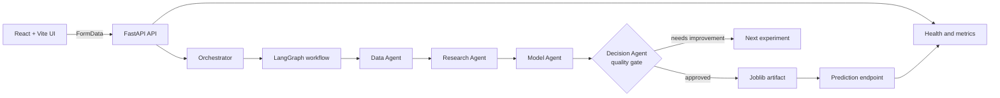
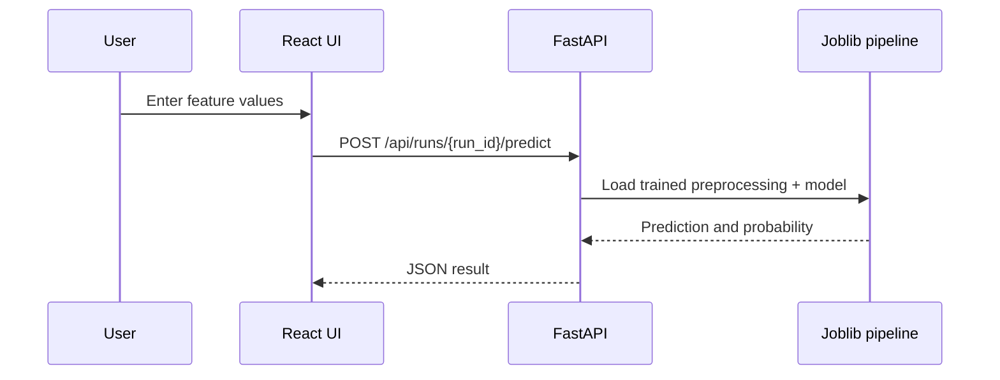
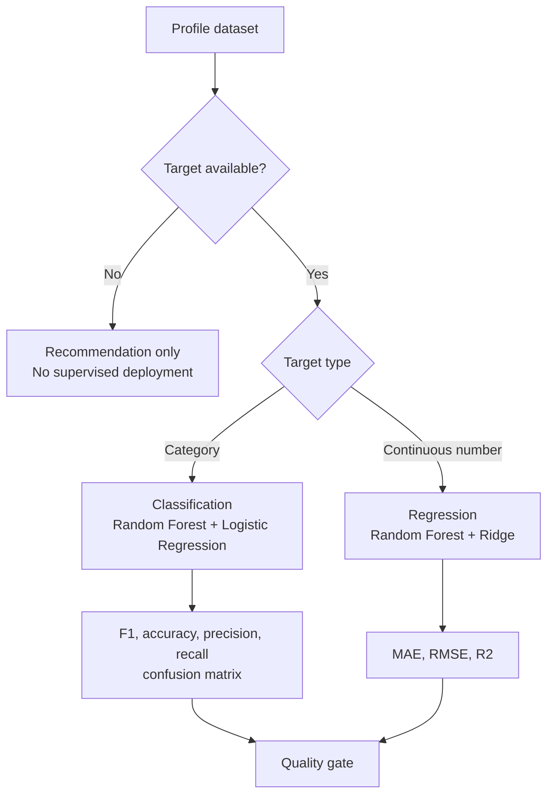

# AI Engineering Agent Architecture

## Purpose

The application turns an uploaded dataset into an evidence-based model decision. It is local-first: the complete workflow runs without cloud credentials or an external LLM.

## System flow



### Request path

1. The React form sends the dataset, target column, metric, goal, and minimum score to `POST /api/analyze`.
2. FastAPI validates the upload and passes the bytes plus request settings to the orchestrator.
3. The orchestrator profiles the data, creates the research plan, evaluates models, and applies the quality gate.
4. The API returns the complete run result, including stages, metrics, decision, deployment state, and monitoring signals.

### Prediction path



## Agent responsibilities

| Agent | Responsibility | Output |
| --- | --- | --- |
| Data Agent | Detect format, schema, column types, missing values, duplicates, and target | Dataset profile and quality report |
| Research Agent | Select methods from the approved local catalog | Methods and experiment plan |
| Model Agent | Preprocess data, train candidates, and evaluate them | Metrics and best model |
| Decision Agent | Compare the selected metric with the requested threshold | `approved` or `needs_improvement` |
| DevOps Agent | Fit the winning pipeline and save it | `artifacts/<run_id>.joblib` |
| Monitoring Agent | Register workflow, latency, error, and prediction signals | Prometheus metrics and signal names |

## ML decision paths



All supervised models use a leakage-safe scikit-learn `Pipeline`. Numeric columns use median imputation and scaling. Categorical columns use most-frequent imputation and one-hot encoding. The preprocessing and estimator are saved together for consistent prediction.

## Repository boundaries

```text
frontend/src/main.jsx       React UI and API requests
frontend/vite.config.js     Vite development server and /api proxy
app/main.py                 FastAPI routes and in-memory run registry
app/orchestrator.py         End-to-end workflow and deployment decision
app/pipeline.py             Parsing, profiling, preprocessing, training, metrics
app/research.py             Approved research and model catalog
app/workflow_graph.py       LangGraph nodes and conditional routing
app/metrics.py              Prometheus counters and latency metrics
artifacts/                  Serialized approved model pipelines
tests/                      Backend behavior tests
```

## Technology decisions

| Area | Choice | Why |
| --- | --- | --- |
| Frontend | React + Vite | React renders the upload and result screens. Vite serves the frontend and forwards `/api` requests during local development. |
| API | FastAPI | Provides one HTTP boundary for upload, workflow, prediction, health, and metrics. |
| Orchestration | LangGraph | Connects named agents with conditional edges so the decision route is inspectable. |
| Runtime | Python | Runs the API, parsing, orchestration, quality checks, and model workflow. |
| Data processing | pandas and Python readers | Supports CSV, JSON, JSONL, Excel, and Parquet input. |
| Machine learning | scikit-learn | Provides preprocessing, candidate models, holdout evaluation, and reusable pipelines. |
| Model storage | Joblib files | Stores the fitted preprocessing and estimator together for local inference. |
| Research | Approved local catalog | Avoids unsupported citations and external API credentials. |
| Monitoring | Prometheus client | Exposes request, error, prediction, and latency metrics at `/metrics`. |
| Packaging | Docker and Docker Compose | Builds the React frontend and runs the API consistently. |

### Stack connection

```text
React UI -> Vite -> FastAPI -> LangGraph -> Python workflow
                                      |
                                      v
                         pandas -> scikit-learn -> Joblib
                                      |
                                      v
                         FastAPI prediction endpoint
```

## Quality gate and feedback

- The requested metric and minimum score are checked against the winning experiment.
- Duplicate records block deployment.
- Missing labels, too few labeled rows, and unsupported task types block supervised deployment.
- Approved runs create `artifacts/<run_id>.joblib`.
- Blocked runs return a next step to change features, preprocessing, or hyperparameters.
- The LangGraph route records whether the next action is deployment or another experiment.

## Runtime endpoints

| Method | Endpoint | Purpose |
| --- | --- | --- |
| `GET` | `/health` | Service health check |
| `POST` | `/api/analyze` | Start a workflow run |
| `GET` | `/api/runs/{run_id}` | Read a run result |
| `POST` | `/api/runs/{run_id}/predict` | Run inference with an approved model |
| `GET` | `/api/monitoring/{run_id}` | Read monitoring signals |
| `GET` | `/metrics` | Prometheus exposition endpoint |

## Production gaps

The MVP still needs authentication, durable run storage, a model registry, cloud object storage, real research connectors, MLflow tracking, a real drift detector, fairness testing, security scanning, and cloud tenancy before production use.