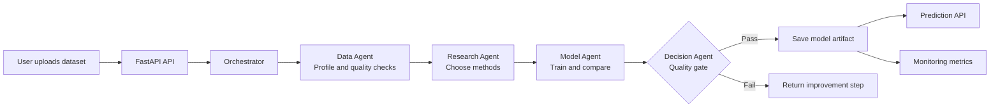
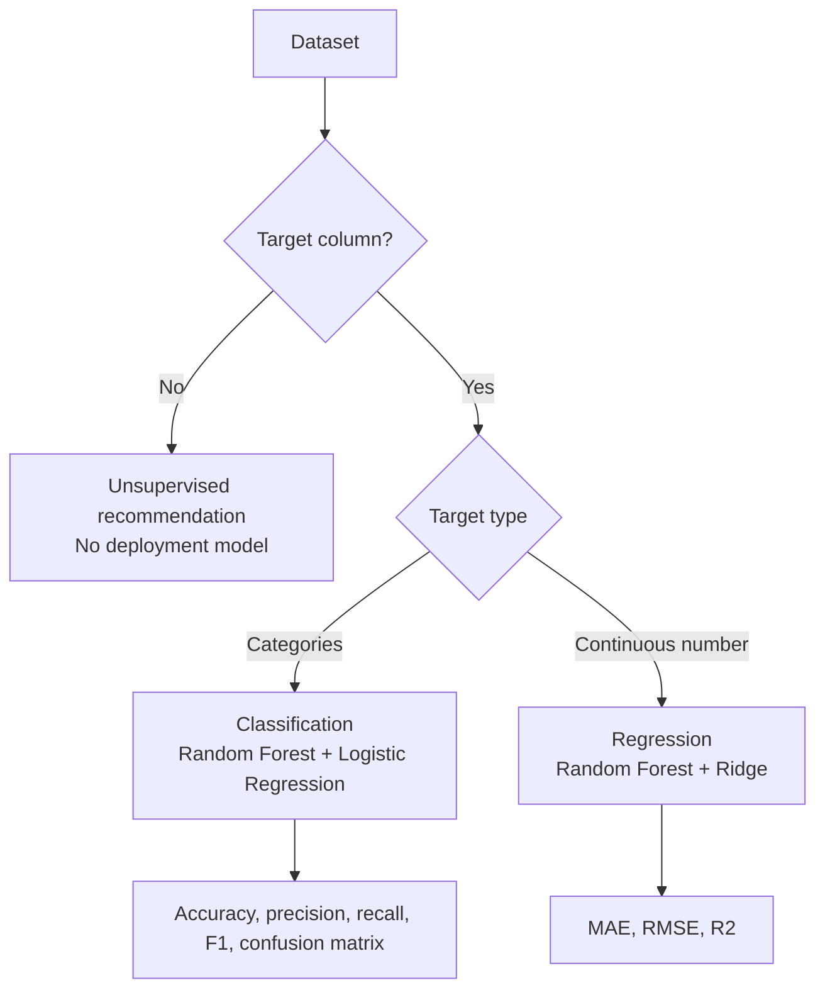

# AI Engineering Agent

Upload a dataset, describe the business goal, and let the application inspect the data, compare models, and decide whether a model is ready to deploy.

## Simple flow



## What happens

| Step | What it does | Main code |
| --- | --- | --- |
| 1. Upload | Receives CSV, JSON, JSONL, Excel, or Parquet | `app/main.py` |
| 2. Profile | Finds columns, types, missing values, row count, and target | `app/pipeline.py` |
| 3. Research | Selects an approved local method catalog | `app/research.py` |
| 4. Train | Builds preprocessing pipelines and tests candidate models | `app/pipeline.py` |
| 5. Decide | Checks the requested metric, score, labels, and duplicates | `app/orchestrator.py` |
| 6. Deploy | Saves an approved model as a Joblib artifact | `artifacts/` |
| 7. Predict | Uses the saved model for new feature values | `app/main.py` |
| 8. Monitor | Exposes latency, errors, predictions, and model signals | `app/metrics.py` |

## Supported ML paths



The pipeline uses median imputation and scaling for numeric columns, most-frequent imputation and one-hot encoding for categorical columns, and keeps preprocessing together with the model to avoid training/inference differences.

## Project structure

```text
AI Engineering Agent/
├── app/
│   ├── main.py              # FastAPI routes and file upload
│   ├── orchestrator.py      # Runs the complete agent workflow
│   ├── pipeline.py          # Profiling, preprocessing, training, metrics
│   ├── research.py          # Approved research and model catalog
│   ├── workflow_graph.py    # LangGraph workflow routing
│   ├── metrics.py           # Prometheus metrics
│   └── static/               # Backend-served static UI files
├── frontend/
│   ├── src/main.jsx         # React interface and API calls
│   ├── src/*.css            # Interface styles
│   └── vite.config.js       # Vite dev server and API proxy
├── data/                    # Demo input datasets
├── artifacts/               # Saved approved models
├── tests/                   # Backend tests
├── Dockerfile               # Builds frontend and backend image
├── docker-compose.yml       # Local service and optional infrastructure
└── requirements.txt         # Python dependencies
```

## Technology stack

| Technology | Why it is used |
| --- | --- |
| React | Builds the web page where the user uploads data and starts a run. |
| Vite | Runs the React frontend during development and proxies `/api` calls to FastAPI. |
| FastAPI | Provides file upload, workflow, prediction, health, and metrics endpoints. |
| LangGraph | Connects the named workflow agents and records the next decision route. |
| Python | Runs the backend, data processing, orchestration, and model workflow. |
| pandas | Reads Excel and Parquet files and converts them into rows for profiling. |
| scikit-learn | Detects the task, preprocesses columns, trains models, and calculates metrics. |
| Joblib | Saves the complete preprocessing plus model pipeline for later predictions. |
| Prometheus client | Counts requests, errors, predictions, and latency at `/metrics`. |
| Docker Compose | Runs the API, frontend build, and optional monitoring services consistently. |

### How the stack connects

```text
React browser page
	-> Vite development server
	-> FastAPI HTTP endpoints
	-> LangGraph + Python orchestrator
	-> pandas + scikit-learn pipeline
	-> Joblib model artifact
	-> FastAPI prediction endpoint
```

The research component currently uses a local approved catalog. It does not invent external papers or require an API key. Prometheus reads the metrics endpoint; it is not involved in training or prediction decisions.

## Run locally

Use Python 3.12 for the pinned scientific packages.

### 1. Start the backend

```powershell
py -3.12 -m venv .venv312
.\.venv312\Scripts\Activate.ps1
python -m pip install -r requirements.txt
python -m uvicorn app.main:app --host 127.0.0.1 --port 8010 --reload
```

Backend URLs:

```text
Health:  http://127.0.0.1:8010/health
API:     http://127.0.0.1:8010/docs
Metrics: http://127.0.0.1:8010/metrics
```

### 2. Start the frontend

Open a second terminal:

```powershell
cd frontend
npm install
npm run dev
```

Open the Vite URL shown in the terminal, usually `http://localhost:5173`. The Vite proxy forwards `/api` requests to the backend on port `8010`.

### 3. Run tests

```powershell
.\.venv312\Scripts\python.exe -m pytest -q
```

## Try the demo

Upload `data/customer_churn_demo.csv` in the frontend.

```text
Target column:  churn
Metric:         F1 score
Minimum score:  0.80
```

The file includes missing values so the cleaning and imputation path is visible. A small demo dataset can produce an excellent score without proving production quality.

## API endpoints

| Method | Endpoint | Purpose |
| --- | --- | --- |
| `GET` | `/health` | Check that the service is running |
| `POST` | `/api/analyze` | Upload data and run the workflow |
| `GET` | `/api/runs/{run_id}` | Read a completed run |
| `POST` | `/api/runs/{run_id}/predict` | Predict using an approved model |
| `GET` | `/api/monitoring/{run_id}` | Read monitoring signals |
| `GET` | `/metrics` | Prometheus metrics |

## Docker

The Docker image builds both the React frontend and FastAPI backend:

```powershell
docker compose up --build
```

Open `http://localhost:8010`.

Optional Prometheus, Grafana, PostgreSQL, and MLflow services:

```powershell
docker compose --profile infra up --build
```

## Current limits

- Models and run data are stored locally; there is no durable database yet.
- Research uses a local catalog instead of live paper or document search.
- Monitoring exposes signal names and counters; a full drift detector is still needed.
- Authentication, model registry promotion, security scanning, and cloud storage are not implemented.

See [ARCHITECTURE.md](ARCHITECTURE.md) for the detailed design decisions.
